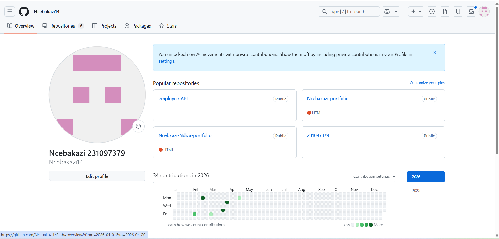

# Ncebakazi Ndiza  
Application Development Student  

📍 Adderley Street, Foreshore, Cape Town  
📧 231097379@mycput.ac.za  
📞 079 284 0932  

---

## 🎯 Career Objective
Motivated Applications Development student seeking opportunities to gain practical experience in software development. Passionate about building real-world digital solutions and improving technical and problem-solving skills.

---

## 🎓 Education

**Kwa-Komani Technical**  
Matric  

**Cape Peninsula University of Technology**  
Higher Certificate in ICT  

**Cape Peninsula University of Technology**  
Diploma in ICT (Applications Development) – Final Year  

---

## 🛠️ Technical Skills

- Java  
- Python  
- HTML  
- CSS  
- Object-Oriented Programming (OOP)  
- UI/UX Design Fundamentals  
- Microsoft Office Suite  

---

## 💼 Projects

**Gym Equipment & Clothing Sales (2023)**  
- Developed a concept for selling fitness equipment  
- Created product organization and pricing structure  

**TrustTrade Marketplace (Java & CSS) (2024)**  
- Contributed to system design and marketplace concept  
- Focused on secure buying and selling  

**Academic Programming (2024–2025)**  
- Built applications using Java and Python  
- Applied OOP and problem-solving techniques  

---

## 💼 Work Experience

**Administrative Assistant – Cyngatha Cafeteria**  
(March 2026 – May 2026)  

- Managed catering orders for corporate events  
- Processed transactions and maintained records  
- Coordinated with kitchen staff for timely delivery  

---

## 📞 References

**Ms N. Malilwana**  
General Manager – Cyngatha Cafeteria  
📞 069 255 8177  

---

**Mr Zukile Ndyalivana**  
Teacher  
📞 062 030 1601  

---

<video width="600" controls>
  <source src="interview.mp4" type="video/mp4">
</video>

# My GitHub Experience — Final Year Reflection

This year was my first time ever using GitHub, and it was quite a journey. 
As part of my final year in ICT Applications Development, I got to experience 
GitHub hands-on through a series of tasks that were all new to me, and I want 
to share how that experience went.

## The Mock Interview

One of the things I did was participate in a mock interview. We were given 
questions to choose from and then recorded ourselves answering them. It was 
my first time doing something like this and it pushed me out of my comfort 
zone, but it was a valuable experience that helped me prepare for real 
interviews in the future.

## Building My CV in Markdown

I also had to code my CV using Markdown directly on GitHub. Coming from 
someone who had never used Markdown before, this was a learning curve on 
its own. I had to figure out the syntax and structure to make sure my CV 
looked clean and presentable.

## Publishing with GitHub Pages

Everything then had to be published using GitHub Pages — meaning anyone 
who clicks the live link gets taken directly to a page where both my CV 
and my mock interview video are displayed and working. Getting everything 
to display correctly was honestly the most challenging part. There were 
moments where things looked fine in the repository but did not render 
properly on the live page, and troubleshooting that took a lot of patience 
and trial and error. But when it finally all came together — the page 
loading, the CV displaying well, and the video actually playing — it was 
genuinely satisfying.

## Overall Reflection

If I am being honest, using GitHub for the first time was frustrating at 
times. Everything felt unfamiliar — repositories, commits, pushing files, 
and setting up Pages. But looking back, I am really proud of what I managed 
to put together. This experience taught me patience, problem-solving, and 
the importance of pushing through when things get difficult. These are skills 
I will carry with me as I step into my career as a developer.
